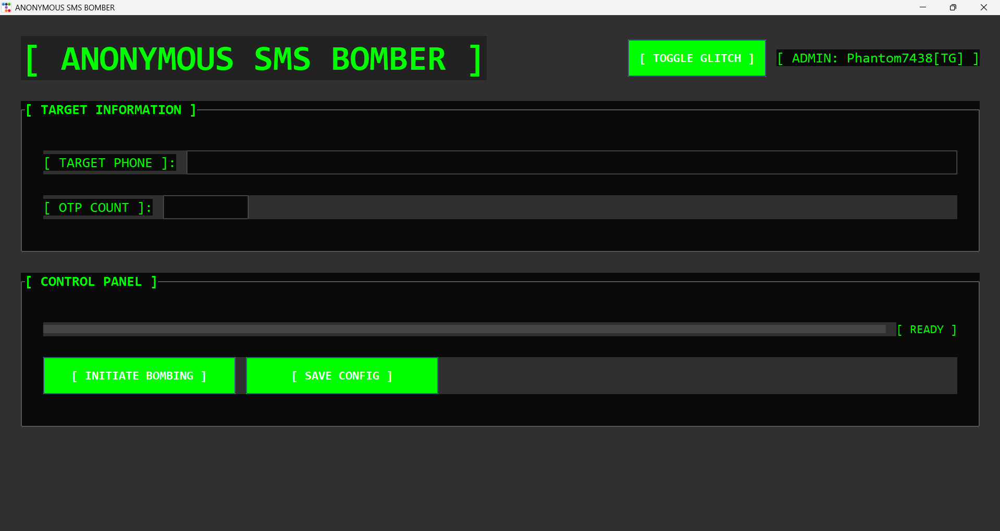

# 🕶️ ANONYMOUS OTP Spammer Tool

> A GUI-based professional OTP testing tool for educational and security research purposes only.

## 🖼 UI Preview

---

## 🧰 Features

- 🔐 Send OTP requests to a specified mobile number [+91 working]
- 🧑‍💻 GUI built with `tkinter` — clean and professional design
- 📩 Choose how many OTPs to send
- 💨 Automatically manipulates payloads for bypass/rate-limit testing

---

## ⚠️ Disclaimer

This tool is created **strictly for ethical hacking, penetration testing, and educational use only**.  
You are fully responsible for your actions. Use responsibly.

---

## 🚀 How to Use
## 📥 Download the Tool

You can download the latest version of the ANONYMOUS OTP Tool from the link below:

➡️ [Download EXE from MEGA](https://mega.nz/file/3h4HCS7K#X8whuw6xQVj3VIhtEC6vHSGeZ5tTSCXRkBEAUZQqpJs)  
*File Size: 27 MB | Platform: Windows | Format: `.exe`*

1. **Download** the `.exe` file
2. **Run** the tool
3. Enter the **target mobile number** and number of **OTP requests** to send.
4. Click **Start** and monitor the logs for results.
